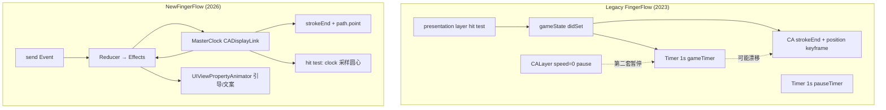
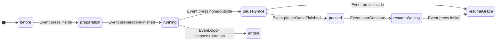

# FingerFlow 动画架构对比（Legacy vs New）

## 1. 总览：从「三时钟 + 分散 switch」到「单时钟 + Reducer」



### 核心摘要

> **Legacy**：三条互不同步的时钟——1 秒 Timer 记业务时间、CA 动画自己跑进度、暂停还要再冻一层 layer；状态在 VC、Timer 回调、通知里各写各的 `switch`。
>
> **NewFingerFlow**：一个 MasterClock 的 `elapsed` 每帧驱动路径、圆点和里程碑；所有输入进 Reducer，输出 Effect 列表，VC 只负责执行；暂停就是停 DisplayLink，命中检测用几何而不是 presentation layer。

> **说明**：Reducer / Effect 等是**组织方式**；下列 §2 是**运行时行为、API 与算法**层面的改动——QA 和用户能直接感知差异的部分。

## 2. 技术层面改动（运行时 / API / 算法）

### 架构 vs 技术：怎么区分

| 类型 | 改什么 | 典型收益 | 例子 |
|------|--------|----------|------|
| **架构型** | 代码结构与协作 | 可读、可测、可画状态图 | Reducer、`send` 单入口、Effect 列表 |
| **技术型** | 引擎、算法、API 选型 | 修 bug、精度、确定性、少踩坑 | DisplayLink、弧长采样、几何 hit test |

Master Clock / Reducer 既是架构选择，也是**承载**下列技术修复的前提——若只换 Reducer、仍用 CA 双动画 + 1s Timer，多数体验问题不会消失。

### 2.1 路径与圆点同步：去掉「双线不同速」

Legacy 两条 CA 动画 **duration 故意设为不同**：

| 元素 | Legacy CA | duration |
|------|-----------|----------|
| 蓝线路径 | `strokeEnd` CABasicAnimation | `duration` |
| 引导圆点 | `position` CAKeyframeAnimation | `duration + startPath.length / 15` |

再叠加 1s 一次的 `pastDuration`，形成 **线、点、业务计时三条时间线**。  
**New**：每帧 `applyPlayback(elapsed:duration:)` 用**同一** `fraction = elapsed/duration` 设置 `strokeEnd` 并调用 `path.point(atFraction:)` 摆圆点——几何上强制同源。

### 2.2 计时引擎：Timer vs CADisplayLink（主进度时钟）

> **范围**：对比的是 **主游戏进度**——Legacy 的 `gameTimer` vs New 的 `masterClock`。  
> 准备 3s、暂停宽限 5s 等 **离散倒计时**，Legacy 仍用 `Timer`，New 用 `NewFingerFlowCountdownClock`（Task），两边思路相近，不在此表。

#### 机制对比

| 维度 | Legacy `Timer` | New `CADisplayLink` |
|------|----------------|---------------------|
| 触发频率 | 固定 **1 秒** 一次 | 跟屏幕刷新，约 **60Hz**（ProMotion 设备更高） |
| 时间累加 | `pastDuration += 1` | `elapsed += (timestamp - lastTimestamp)`，真实 Δt |
| 驱动什么 | 仅 **业务逻辑**（welldone、结束、completing 文案） | **业务 + 画面** 共用同一 `elapsed` |
| 画面进度 | 另靠 CA 动画独立跑（`strokeEnd`、`position` keyframe） | 每帧 `applyPlayback` 写 `strokeEnd`、摆圆点 |
| 暂停 | `Timer.pause()`（改 `fireDate` + associated object） | `suspend()` = 停 DisplayLink，`elapsed` 冻结 |
| 与屏幕同步 | 否，与帧率无关 | 是，`.common` mode 下与渲染周期对齐 |

Legacy 创建（`FingerFlowVC+Game.swift`）：

```swift
gameTimer = Timer.scheduledTimer(timeInterval: 1, target: self,
                                 selector: #selector(gameTimerAction), repeats: true)
// gameTimerAction: pastDuration += 1 → welldone / completing / end
```

New tick（`NewFingerFlowMasterClock.swift`）：

```swift
elapsed += delta
delegate?.masterClock(self, didTick: elapsed, duration: duration)
// VC: applyPlayback(elapsed) + send(.masterClockTick)
```

#### 双轨 vs 单轨

```
Legacy（两条时间线）
  gameTimer (1 Hz)  → pastDuration、welldone、结束
  CA 动画           → strokeEnd、圆点 position（duration 还与 Timer 不同）

New（一条时间线）
  DisplayLink → elapsed → strokeEnd + 圆点位置 + Reducer 里程碑
```

#### 对本项目的实际差异

| 点 | Legacy | New |
|----|--------|-----|
| **精度** | 计时粒度 1s；completing 文案最多 1s 跳变 | 亚秒级；completing 每 tick 可更新 |
| **线点同步** | Timer 与 CA 无代码绑定，且两条 CA duration 不同 | 同一 `fraction = elapsed/duration` |
| **暂停** | 需同步 `gameTimer.pause()` 与 `CALayer.speed=0` | `masterClock.suspend()` 一处停表 |
| **welldone** | `Int(pastDuration) % 15 == 0` | 整数秒 + `welldoneShownAtSeconds` 去重 |
| **结束** | Timer 回调 `gameState = .end` | `elapsed >= duration` → Reducer |

#### 适用场景（为何这样选）

| API | 适合 |
|-----|------|
| `Timer` | 离散、低频率（每秒 +1、5 秒倒数） |
| `CADisplayLink` | 需与画面同步的连续进度（路径生长、圆点移动） |

New 的策略：**主进度用 DisplayLink，离散倒计时仍用 Task**——各用合适的工具，不是「全面抛弃 Timer」。

### 2.3 暂停：Timer + CALayer 双轨黑魔法 → `suspend()` DisplayLink

Legacy 暂停需**同时**操作两套互不相关的 API：

```
gameTimer.pause()     → fireDate = .distantFuture + objc 存剩余 interval（Timer+PauseResume）
guideDot/layer.pause() → speed = 0 + timeOffset + resume 时 beginTime 补偿（CALayer 扩展）
```

恢复顺序或状态任一出错，就会出现「计时走了线没动」或相反。  
**New**：`masterClock.suspend()` = `invalidate` DisplayLink，`elapsed` 自然冻结；`resume()` 重新 link，从原 `elapsed` 继续——**无** layer timeOffset、**无** Timer fireDate 技巧。

### 2.4 命中检测：presentation 矩形 → 弧长圆心 + 几何圆

| | Legacy | New |
|---|--------|-----|
| 读什么 | `guideDot.layer.presentation()?.frame` | `lastDotCenter`（clock 采样） |
| 判定 | axis-aligned **矩形** `contains(point)` | `hypot(touch, center) ≤ 55` **圆形**阈值 |
| 暂停时 | 依赖 CA 是否冻结、presentation 是否有效 | `dotFrozen` 时仍用冻结前的 `lastDotCenter` |
| 与进度关系 | 与 strokeEnd 无代码级绑定 | 圆心 = `path.point(atFraction: f(elapsed))` |

### 2.5 路径采样：`CGPath+PointAtFraction`（新增算法）

Legacy 圆点沿路径由 `CAKeyframeAnimation(path:)` + `.paced` 交给 Core Animation 插值。  
New 自研 **按弧长比例取点**（`CGPath+PointAtFraction.swift`）：

- 遍历 path 元素（直线 / 二次 / 三次贝塞尔）
- 曲线段 24 步折线逼近，累加弧长至 `targetLength = length × fraction`
- 支撑 Master Clock 每帧手动 `positionGuideDot(at:)`

没有这层采样，就无法在去掉 CA position 动画后仍保证圆点贴线。

### 2.6 动画生命周期：无限 CA + `isRemovedOnCompletion=false` → PropertyAnimator

Legacy 引导循环依赖 **无限 repeat** 的 `CAKeyframeAnimation`，并设 `isRemovedOnCompletion = false`（注释：避免退后台动画消失）——典型 model/presentation 分离 + `fillMode` 坑。  
**New**：`NewFingerFlowGuideAnimator` / `NewFingerFlowPromptAnimator` 用 **UIViewPropertyAnimator 链式循环**；`stop()` 时 `stopAnimation(true)` 并复位 transform/alpha，退后台与切状态时可确定性 teardown。

### 2.7 辅助倒计时：Timer target/selector → `Task` + cancel

| | Legacy | New |
|---|--------|-----|
| 准备 / 宽限 | `Timer.scheduledTimer(target:selector:)` | `NewFingerFlowCountdownClock`（Swift `Task`） |
| 清理 | `invalidate` | `task?.cancel()` + `viewWillDisappear` 统一 cancel |
| 与 VC 耦合 | selector 强引用 target | `onTick` / `onFinish` 闭包 → `send(Event)` |

### 2.8 动画实现技术优化（Legacy CA 被动 → New 主动驱动）

> 本节从 **动画实现** 角度汇总技术优化（不含 Reducer 架构）。核心变化：**去掉 CA 进度动画，改为 DisplayLink 驱动下每帧写 model + 弧长采样摆点**。

#### 2.8.1 路径 + 圆点：两条 CA → 每帧写 model

**Legacy**（`drawCircleList`）：路径与圆点各一条 CA，duration 不一致：

```swift
animateStrokeEnd.duration = duration
let dotDuration = duration + startPath.cgPath.length / 15
circleAnimation.duration = dotDuration
```

**New**（`applyPlayback`）：去掉 CA 进度动画，每帧计算并写入：

```swift
let strokeFraction = strokeStartFraction + (1 - strokeStartFraction) * CGFloat(t)
gameLayer?.strokeEnd = strokeFraction
let point = path.point(atFraction: strokeFraction)
positionGuideDot(at: point)
```

#### 2.8.2 暂停：layer 时间魔法 → 停时钟

| | Legacy | New |
|---|--------|-----|
| 路径/圆点 | `CALayer.speed = 0` + `timeOffset` / `beginTime` 补偿 | 停 DisplayLink，不再调用 `applyPlayback` |
| 业务计时 | `gameTimer.pause()` / `resume()` | `elapsed` 随 DisplayLink 自然冻结/继续 |
| 风险 | 两套 API 恢复顺序错会「计时走了线没动」 | 单一 `elapsed`，恢复后续写即可 |

#### 2.8.3 命中检测：presentation 矩形 → 几何圆

- **Legacy**：`guideDot.layer.presentation()?.frame.contains(point)` — 依赖 CA 运行/冻结状态。
- **New**：`hypot(touch, lastDotCenter) ≤ 55`，圆心来自 `path.point(atFraction:)` — 与进度同源；暂停用 `lastDotCenter` / `dotFrozen`。

#### 2.8.4 引导/文案：无限 CA → PropertyAnimator

| | Legacy | New |
|---|--------|-----|
| 引导循环 | 无限 `CAKeyframeAnimation` + `repeatCount = MAXFLOAT` | `NewFingerFlowGuideAnimator` 链式 `UIViewPropertyAnimator` |
| 退后台 | `isRemovedOnCompletion = false` 防消失 | `stop()` → `stopAnimation(true)` + 复位 alpha/transform |
| 切状态 | 需手动 `removeAllAnimations` | 可确定性 teardown |

#### 2.8.5 路径采样：CA 黑盒 → `CGPath+PointAtFraction`

Legacy 圆点轨迹交给 `CAKeyframeAnimation(path:)` + `.paced`。  
New 自研弧长采样（直线 / 二三次贝塞尔，曲线 24 段逼近），支撑 Master Clock 每帧手动摆点——**去掉 CA position 动画的前提**。

#### 2.8.6 里程碑与结束：跟随时钟 tick

| 事件 | Legacy（1s Timer 边界） | New（DisplayLink tick） |
|------|------------------------|-------------------------|
| welldone | `Int(pastDuration) % 15 == 0` | `Int(elapsed) % 15 == 0` + Set 去重 |
| completing | `(duration - pastDuration) == 10` 触发；文案 1s 更新 | 剩余 ≤10s 触发；文案每 tick 可更新 |
| 冻圆点 | `(duration - pastDuration) == 2` | `remaining <= 2s` 于 `handleClockTick` |
| 结束 | `gameTimerAction` → `gameState = .end` | `elapsed >= duration` → `.ended` |

#### 2.8.7 动画层优化总览

| 优化点 | Legacy 问题 | New 做法 |
|--------|------------|----------|
| 时间源 | Timer + CA 双轨 | DisplayLink 单变量 `elapsed` |
| 线点同步 | 两条 CA duration 不同 | 同一 fraction → strokeEnd + point |
| 暂停 | Timer + CALayer 两套 API | `suspend()` / `resume()` DisplayLink |
| 圆点轨迹 | CA keyframe 黑盒插值 | 弧长采样，可控 |
| Hit test | presentation 矩形 | 几何圆 + clock 采样圆心 |
| 引导循环 | 无限 CA + don't remove | PropertyAnimator 可 stop |
| 精度 | 1 Hz | ~60 Hz Δt |

### 2.9 技术改动总览

| # | 问题 | Legacy 根因 | New 解法 | 用户/QA 可感知 |
|---|------|-------------|----------|----------------|
| 1 | 线点不同步 | 两条 CA duration 不同 | 同一 `elapsed` → strokeEnd + point | ✅ |
| 2 | 暂停后判圈异常 | presentation + 矩形 frame | 几何圆 + clock 采样圆心 | ✅ |
| 3 | 计时与画面漂移 | Timer vs CA 双轨 | DisplayLink 单变量 | ⚠️ 边缘场景 |
| 4 | 退后台引导动画 | CA repeat + don't remove | PropertyAnimator stop/start | ⚠️ |
| 5 | welldone 重复弹 | 1s 边界无去重 | 整数秒 + Set 去重 | ⚠️ |
| 6 | 结束前圆点行为 | Timer `== 2` 秒边界 | `freezeGuideDot` + `dotFrozen` | ⚠️ |
| 7 | 状态难维护 | 分散 switch | Reducer（**偏架构**） | ❌ 主要开发者 |

## 3. 时间轴对比（同一段「游戏中暂停」）

```
Legacy                          NewFingerFlow
────────────────────────────────────────────────────────────
gameTimer tick (1s)             displayLink tick (~60/s)
    │                               │
    ├─ pastDuration += 1            ├─ elapsed += Δt  (同一变量)
    │                               │
CA strokeEnd 动画 (duration)        strokeEnd = f(elapsed/duration)
    │                               │
    ├─ 暂停: layer.speed=0          ├─ 暂停: clock.suspend()
    ├─ 恢复: beginTime 偏移         ├─ 恢复: clock.resume()
    │                               │
pauseTimer 另计 5s                  CountdownClock Task 5s
    │                               │
welldone @ 15s 整数边界             welldone @ Int(elapsed)%15 + 去重
```

**分享结论**：Legacy 的进度条与业务计时器是两条时间线；New 用 **一条 `elapsed`** 驱动路径、里程碑文案、结束判定。详见 §2.2（Timer vs DisplayLink）、§2.8（动画实现优化）。

## 4. 状态机 P2：分散 switch → 单入口 `send`



**Legacy**：`onPressStateUpdate` + `_onStateUpdate` + `gameTimerAction` + 通知 四处改 `gameState`。

**New**：`NewFingerFlowReducer.send(_:)` 返回 `[Effect]`，VC 只 `apply(effects)`。

### Legacy vs New 状态转移对照表

#### 状态枚举映射

| Legacy `FingerFlowState` | New `NewFingerFlowPhase` | 含义 |
|--------------------------|--------------------------|------|
| `before` | `before` | 开局引导循环 |
| `preparation` | `preparation` | 准备倒计时 3s |
| `start` | `running` | 主时钟运行中 |
| `pauseCountdown` | `pauseGrace` | 松手后 5s 宽限期 |
| `pause` | `paused` | 暂停弹层 |
| `resumeFromPauseCountdown` | `resumeGrace` | 宽限期内手指回圈内，恢复路径 |
| `resumeFromPauseWaiting` | `resumeWaiting` | 点「继续」后等待长按 |
| `resumeFromPauseRunning` | `resumeGrace` | 恢复等待中手指回圈内（同 resumeGrace） |
| `end` | `ended` | 本局结束 |

#### 完整转移对照

| # | 触发条件 | Legacy 转移 | Legacy 入口 | New 转移 | New Event |
|---|----------|-------------|-------------|----------|-----------|
| 1 | 引导页长按进圈 | `before` → `preparation` | `onPressStateUpdate` | `before` → `preparation` | `pressChanged(.inside)` |
| 2 | 准备中松手/出圈 | `preparation` → `before` | `onPressStateUpdate` | `preparation` → `before` | `pressChanged(.none/.outside)` |
| 3 | 准备倒计时结束 | `preparation` → `start` | `onPreparationCountdownEnd` | `preparation` → `running` | `preparationFinished` |
| 4 | 游戏中松手 | `start` → `pauseCountdown` | `onPressStateUpdate` | `running` → `pauseGrace` | `pressChanged(.none)` |
| 5 | 游戏中手指出圈 | `start` → `pauseCountdown` | `onPressStateUpdate` | `running` → `pauseGrace` | `pressChanged(.outside)` |
| 6 | 宽限期内回圈 | `pauseCountdown` → `resumeFromPauseCountdown` | `onPressStateUpdate` | `pauseGrace` → `resumeGrace` | `pressChanged(.inside)` |
| 7 | 宽限期倒计时结束 | `pauseCountdown` → `pause` | `pauseTimerAction` | `pauseGrace` → `paused` | `pauseGraceFinished` |
| 8 | 暂停页点退出 | `pause` → `end` → `before` | pauseView 按钮 | `paused` → `before` | `userTappedExitOnPause` |
| 9 | 暂停页点继续 | `pause` → `resumeFromPauseWaiting` | pauseView 按钮 | `paused` → `resumeWaiting` | `userTappedContinueOnPause` |
| 10 | 恢复等待中回圈 | `resumeFromPauseWaiting` → `resumeFromPauseRunning` | `onPressStateUpdate` | `resumeWaiting` → `resumeGrace` | `pressChanged(.inside)` |
| 11 | 恢复等待中松手/出圈 | 保持，仅 showPrompt | `onPressStateUpdate` | 保持，仅 showPrompt | `pressChanged(.none/.outside)` |
| 12 | 恢复宽限中松手/出圈 | → `pauseCountdown` | `onPressStateUpdate` | → `pauseGrace` | `pressChanged(.none/.outside)` |
| 13 | 游戏时间到 | `start` → `end` | `gameTimerAction` | `running` → `ended` | `masterClockTick`（elapsed ≥ duration） |
| 14 | 退后台（游戏中） | `start` 等 → `pauseCountdown` | `didEnterBackground` 通知 | `running/resumeGrace` → `pauseGrace` | `appEnteredBackground` |
| 15 | 退后台（准备中） | `preparation` → `before` | `didEnterBackground` 通知 | `preparation` → `before` | `appEnteredBackground` |
| 16 | 重置 / 初始化 | `resetData` + `before` | `_onStateUpdate` | → `before` | `resetRequested` |

**对照说明**

- Legacy 用 **9 个 state 名** 描述「场景」（如 `resumeFromPauseCountdown`），New 用 **8 个 phase** + 独立的 `press` 维度，语义更紧凑。
- Legacy 的 `resumeFromPauseCountdown` 与 `resumeFromPauseRunning` 在 New 中统一为 `resumeGrace`（主时钟继续 tick）。
- Legacy 结束走 `end` 再弹结果页回到 `before`；New 的 `ended` 由 Reducer 触发，`userTappedExitOnPause` 直接回 `before`（结果页逻辑待接）。

## 5. 命中检测：presentation vs 几何

```
Legacy touch
    → guideDot.layer.presentation()?.frame.contains(point)

New touch
    → hypot(touch, lastDotCenter) ≤ 55
    → lastDotCenter = path.point(atFraction: f(elapsed))
```

暂停时 Legacy 依赖 presentation 是否冻结；New 与 **主时钟采样** 一致，不依赖 CA 魔法。详见 §2.4、§2.5、§2.8.3。

## 6. 迁移清单（P1–P3 对照）

| 优先级 | 类型 | 项 | Legacy | NewFingerFlow |
|--------|------|-----|--------|---------------|
| **P1** | 技术 | 进度与时间 | Timer + CA 双轨（线点不同速） | `NewFingerFlowMasterClock` + `applyPlayback` |
| **P1** | 技术 | 路径圆点采样 | CA `position` keyframe | `CGPath+PointAtFraction` 弧长采样 |
| **P1** | 技术 | 暂停/resume | Timer pause + CALayer speed/beginTime | `masterClock.suspend()` / `resume()` |
| **P2** | 架构 | 状态转移 | 多文件 switch | `NewFingerFlowReducer` + `Effect` |
| **P3** | 技术 | 引导/文案动效 | 无限 CAKeyframeAnimation | `NewFingerFlowGuideAnimator` / PropertyAnimator |
| **P3** | 技术 | UI 微动效 | CABasicAnimation 样板 | `UIViewPropertyAnimator` / 弹簧 |
| **P3** | 技术 | 离散倒计时 | Timer selector | `NewFingerFlowCountdownClock`（Task） |

## 7. 优化要点总结

**技术向**

1. **Timer → DisplayLink** — 主进度从 1 Hz Timer 改为 ~60 Hz Δt；业务与画面共用 `elapsed`（§2.2）。
2. **线点同源** — 同一 `elapsed` 驱动 `strokeEnd` 与 `path.point(atFraction:)`，消除 Legacy 双线不同速（§2.8.1）。
3. **几何 hit test** — 55pt 圆 + clock 采样圆心；暂停时不依赖 presentation layer（§2.8.3）。
4. **暂停简化** — 停 DisplayLink 即可，不再同步 Timer fireDate 与 CALayer beginTime（§2.8.2）。
5. **PropertyAnimator 引导** — 可中断循环、退后台 teardown 比 `isRemovedOnCompletion=false` 更清晰（§2.8.4）。

**架构向**

6. **Master Clock 模式** — 音游/冥想类 App 通用解法，可接 SwiftUI `TimelineView`。
7. **Reducer + Effect** — 转移表可单测，便于画状态图给 QA。

---