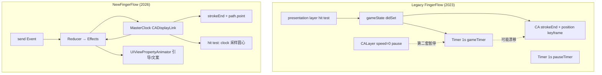
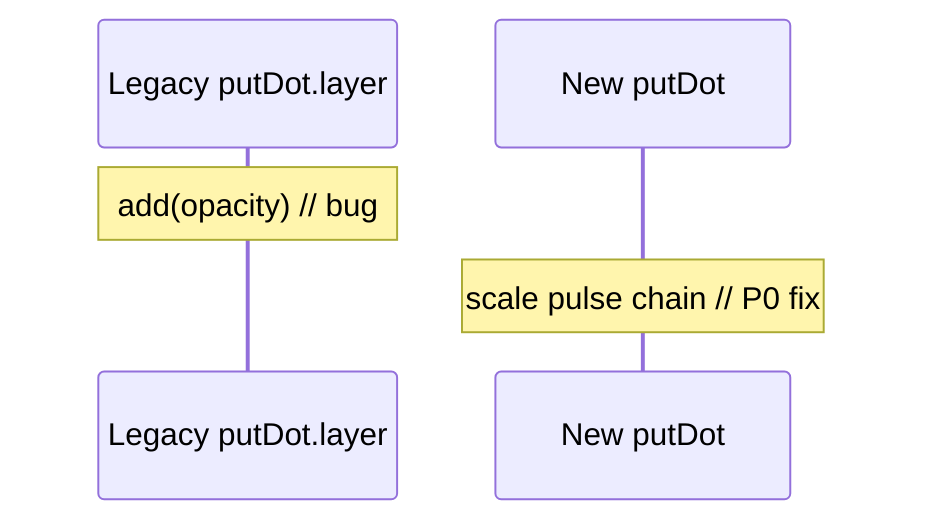
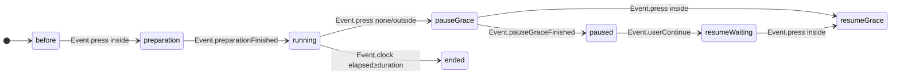

# FingerFlow 动画架构对比（Legacy vs NewFingerFlow）

> 一页技术分享用示意图 · 2026

## 1. 总览：从「三时钟 + 分散 switch」到「单时钟 + Reducer」



## 2. 时间轴对比（同一段「游戏中暂停」）

```
Legacy                          NewFingerFlow
────────────────────────────────────────────────────────────
gameTimer tick (1s)             displayLink tick (~60/s)
    │                               │
    ├─ pastDuration += 1            ├─ elapsed += Δt  (同一变量)
    │                               │
CA strokeEnd 动画 (duration)        strokeEnd = f(elapsed/duration)
    │                               │
    ├─ 暂停: layer.speed=0          ├─ 暂停: clock.suspend()
    ├─ 恢复: beginTime 偏移         ├─ 恢复: clock.resume()
    │                               │
pauseTimer 另计 5s                  CountdownClock Task 5s
    │                               │
welldone @ 15s 整数边界             welldone @ floor(elapsed)%15
```

**分享结论**：Legacy 的进度条与业务计时器是两条时间线；New 用 **一条 `elapsed`** 驱动路径、里程碑文案、结束判定。

## 3. 引导动画 P0：putDot 贴错 Key 的修复

| | Legacy `animateBeforeGame` | New `NewFingerFlowGuideAnimator` |
|---|---------------------------|----------------------------------|
| promptLabel | `CAKeyframeAnimation opacity` ✓ | `UIViewPropertyAnimator` 链式 0→1→hold→0 |
| putDot | **误用** `keyAnimate`（opacity）✗ | **独立** scale 0→1→0→1→0 ✓ |
| 退后台 | `isRemovedOnCompletion=false` | 可暂停的 PropertyAnimator |



## 4. 状态机 P2：分散 switch → 单入口 `send`



**Legacy**：`onPressStateUpdate` + `_onStateUpdate` + `gameTimerAction` + 通知 四处改 `gameState`。

**New**：`NewFingerFlowReducer.send(_:)` 返回 `[Effect]`，VC 只 `apply(effects)`。

## 5. 命中检测：presentation vs 几何

```
Legacy touch
    → guideDot.layer.presentation()?.frame.contains(point)

New touch
    → hypot(touch, lastDotCenter) ≤ 55
    → lastDotCenter = path.point(atFraction: f(elapsed))
```

暂停时 Legacy 依赖 presentation 是否冻结；New 与 **主时钟采样** 一致，不依赖 CA 魔法。

## 6. 迁移清单（P0–P3 对照）

| 优先级 | 项 | Legacy | NewFingerFlow |
|--------|-----|--------|---------------|
| **P0** | putDot 引导动画 | opacity key 误贴 | `NewFingerFlowGuideAnimator` scale 链 |
| **P1** | 进度与时间 | Timer + CA 双轨 | `NewFingerFlowMasterClock` + `applyPlayback` |
| **P2** | 状态转移 | 多文件 switch | `NewFingerFlowReducer` + `Effect` |
| **P3** | UI 微动效 | CABasicAnimation 样板 | `UIViewPropertyAnimator` / 弹簧 |

## 7. 分享时可强调的「现代点」

1. **Master Clock 模式** — 音游/冥想类 App 的通用解法，可接 SwiftUI `TimelineView`。
2. **Reducer + Effect** — 可单测转移表，便于画状态图给 QA/设计。
3. **PropertyAnimator** — 可中断、与退后台策略更清晰（相对 `fillMode=forwards`）。
4. **几何 hit test** — 与曲线进度耦合，比 presentation frame 更可预测。

---

*文件位置：`YKFingerFlow/NewFingerFlow/` · 入口：`NewFingerFlowViewController`*
