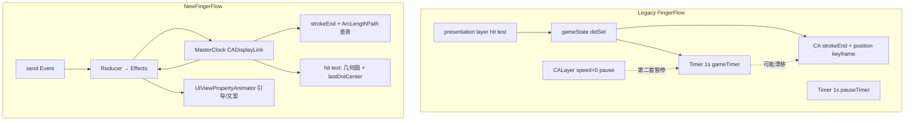
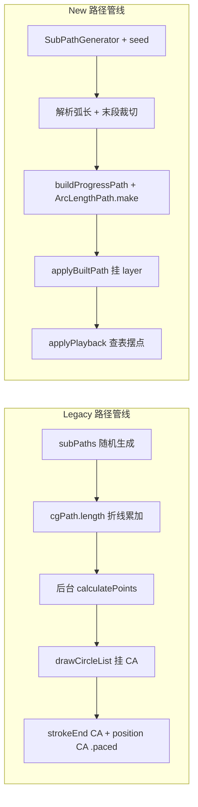
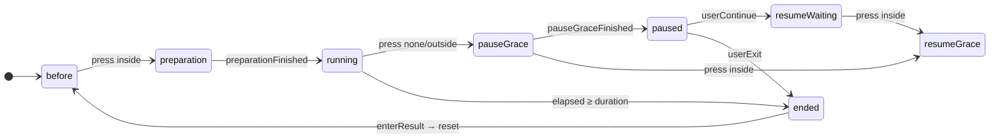

# FingerFlow 重构优化说明（Legacy vs NewFingerFlow）

本文对比 **Legacy**（`LegacyFingerFlow/`，2023）与重构后的 **NewFingerFlow**（`NewFingerFlow/`，2026）在**用法**与**算法**上的差异。  
Legacy 源码未被修改；New 为并行实现，并复用部分 Legacy 组件（资源枚举、时长选择器、结果页等）。

原设计相关文档：  
[【交互篇】用 Swift 完成贝塞尔曲线游戏](https://juejin.cn/post/7293723900588654644)  
[【算法篇】用 Swift 完成贝塞尔曲线游戏](https://juejin.cn/post/7244840680383365177)

---

## 1. 总览

### 1.1 文档结构


| 章节            | 内容                             |
| ------------- | ------------------------------ |
| **§1 总览**     | 架构、**路径算法**、时钟与动画一句话对比（本章）     |
| **§2 用法对比**   | 入口、模块、生命周期调用链、Reducer          |
| **§3 路径算法对比** | 构建 / stroke 起点 / 播放 / 弧长采样（展开） |
| **§4**        | 时钟与动画算法                        |
| **§5**        | 状态机与完整转移对照                     |
| **§6**        | 迁移清单（P0–P3）                    |
| **§7**        | 设计收益                           |
| **§8**        | 总结                             |


### 1.2 架构与时钟




| 维度    | Legacy                          | New                               |
| ----- | ------------------------------- | --------------------------------- |
| 状态    | `gameState` 分散在 VC / Timer / 通知 | `NewFingerFlowReducer` + `Effect` |
| 主进度时钟 | 1 Hz `Timer` + CA 双动画           | `CADisplayLink` 单变量 `elapsed`     |
| 命中检测  | `presentation()?.frame` 矩形      | `hypot(touch, center) ≤ 55` 圆形    |
| 引导动效  | 无限 `CAKeyframeAnimation`        | `UIViewPropertyAnimator` 链式循环     |


### 1.3 路径算法总览

路径由「起始弧（120°）+ 随机圆弧链」组成，目标长度 `lengthNeeded = duration × 15`（pt/s）。  
**§3** 有分步对照与代码；此处为总览摘要。




| 路径阶段            | Legacy                                  | New                                                             | 详见        |
| --------------- | --------------------------------------- | --------------------------------------------------------------- | --------- |
| **生成**          | `UIBezierPath.subPaths`，`Int.random`    | `NewFingerFlowSubPathGenerator`，`SeededRNG`；失败回退 `subPaths`     | §3.1      |
| **构建时机**        | 准备 3s 期间后台 `calculatePoints`            | 进入 `running` 时同步 `rebuildPath`                                  | §2.3      |
| **弧长计算**        | 每段 `cgPath.length`（24 段折线）              | 生成期段长 `radius×angle`；总长与采样表均由 `NewFingerFlowArcLengthPath` 一次建表 | §3.1、§3.4 |
| **stroke 起点**   | `startLen / (duration×15)` 目标长度         | `startArcLen / arcLengthPath.totalLength` 实际总长                  | §3.2      |
| **运行时播放**       | 双 CA：`strokeEnd` + `position`（`.paced`） | `applyPlayback`：线 `strokeFraction`，点 `dotT` + 弧长表查表             | §3.3      |
| **圆点采样**        | Core Animation 黑盒                       | `NewFingerFlowArcLengthPath` 建表 + `hintIndex` 查表                | §3.4      |
| **线点 fraction** | 两条 CA，duration 不同                       | 仍保持双线映射（`strokeFraction` ≠ `dotT`）                              | §3.3      |


> **核心变化**：Legacy「生成一次 + CA 托管播放」；New「生成增强 + 建弧长表 + DisplayLink 每帧查表摆点」。主时钟合一，**刻意保留** Legacy 线/点双时间映射。

### 1.4 时钟与动画（摘要）


| 维度    | Legacy                            | New                                 |
| ----- | --------------------------------- | ----------------------------------- |
| 画面进度  | CA 独立时间轴                          | `elapsed` → `applyPlayback`         |
| 业务里程碑 | 1 Hz `gameTimer`                  | 同一 `elapsed` + Reducer              |
| 暂停    | `Timer.pause` + `CALayer.speed=0` | `masterClock.suspend()`             |
| 离散倒计时 | `Timer` selector                  | `NewFingerFlowCountdownClock`（Task） |


详见 §4。

### 1.5 核心收益


| 方向   | Legacy 痛点              | New 做法                    | 收益                 |
| ---- | ---------------------- | ------------------------- | ------------------ |
| 时间   | Timer + CA 两套时钟，易漂移    | 单 `elapsed`（DisplayLink）  | 进度、里程碑、画面同源        |
| 路径播放 | CA 黑盒，难调试/改规则          | `applyPlayback` 主动写 model | 线点规则可见、可单测         |
| 圆点采样 | `.paced` 插值不可控         | 构建期建弧长表，运行时查表             | O(1) 均摊，圆心与命中同源    |
| 路径生成 | 随机不可复现，末段长度粗糙          | seed + 解析弧长 + 末段裁切        | 可复现、长度更贴目标         |
| 状态   | 多入口改 `gameState`       | Reducer + Effect          | 转移表集中、可画状态图        |
| 暂停   | Timer + CALayer 两套 API | `suspend()` 停 DisplayLink | 暂停语义 = 冻 `elapsed` |
| 命中   | `presentation` 矩形      | 几何圆 + `lastDotCenter`     | 与采样坐标一致，暂停可判定      |


---

## 2. 用法对比（集成与调用链）

### 2.1 入口


|                | Legacy                               | New                                                 |
| -------------- | ------------------------------------ | --------------------------------------------------- |
| ViewController | `FingerFlowVC()`                     | `NewFingerFlowViewController()`                     |
| 宿主集成           | `pushViewController(FingerFlowVC())` | `pushViewController(NewFingerFlowViewController())` |
| 本仓库 Demo       | `ViewController` 蓝色按钮                | `ViewController` 粉色按钮                               |


### 2.2 模块结构

**Legacy**（`LegacyFingerFlow/Classes/`）


| 区域             | 代表文件                                                             | 职责              |
| -------------- | ---------------------------------------------------------------- | --------------- |
| ViewController | `FingerFlowVC.swift`, `+Game`, `+Media`                          | 状态机、Timer、媒体    |
| View           | `FingerFlowGameView.swift`                                       | 路径、CA 动画、手势     |
| Model          | `FingerFlowExtension.swift`                                      | `subPaths` 路径生成 |
| Utils          | `CGPath+Length.swift`, `Timer+PauseResume.swift`, `CALayer` 暂停扩展 | 弧长、暂停技巧         |


**New**（`NewFingerFlow/`）


| 目录 / 文件                                                       | 职责                                                 |
| ------------------------------------------------------------- | -------------------------------------------------- |
| `ViewController/NewFingerFlowViewController.swift`            | `send` / `apply(effects)` 接线、结果页                   |
| `Core/NewFingerFlowReducer.swift`, `NewFingerFlowTypes.swift` | 状态机                                                |
| `Core/NewFingerFlowPathBuilder.swift`                         | `buildProgressPath` 拼接路径                           |
| `Core/NewFingerFlowSubPathGenerator.swift`                    | 带 seed 的圆弧链生成                                      |
| `Core/NewFingerFlowArcLengthPath.swift`                       | **构建期**建 knot 表；**运行时**查表摆点                        |
| `Core/NewFingerFlowBuiltPath.swift`                           | `cgPath` + `strokeStartFraction` + `arcLengthPath` |
| `Clock/NewFingerFlowMasterClock.swift`                        | 主时钟 DisplayLink                                    |
| `Clock/NewFingerFlowCountdownClock`                           | 准备 / 宽限倒计时 Task                                    |
| `Animation/`                                                  | 引导与文案 PropertyAnimator                             |
| `View/NewFingerFlowGameView.swift`                            | 游戏面、`applyPlayback`、手势                             |
| `View/NewFingerFlowPauseOverlay.swift`                        | 暂停浮层                                               |


**New 复用 Legacy（未重写）**：`FingerFlowTimePicker`、`FingerFlowResultVC`、`FingerFlowBackgroundImage/Music`、`FingerFlowPropmptType` 文案枚举。

### 2.3 生命周期调用链

#### 开局（长按 3s → 开始游戏）

```
Legacy
  before → preparation
    startPreparation → DispatchQueue.global { calculatePoints() }
    3s Timer → onPreparationCountdownEnd
  preparation → start
    startGame → drawCircleList()
      → CAShapeLayer + strokeEnd CA + position CAKeyframeAnimation

New
  before → preparation
    beginPreparationUI → NewFingerFlowCountdownClock 3s
  preparation → running
    preparationFinished → Effects（同批顺序执行）:
      1. rebuildPath(seed, duration)
           → buildProgressPath + ArcLengthPath.make
           → applyBuiltPath（挂 layer、对齐 pathOrigin）
      2. beginPathPlayback → masterClock.start()
```


| 时机          | Legacy                         | New                                                     |
| ----------- | ------------------------------ | ------------------------------------------------------- |
| 路径何时生成      | 准备阶段**后台** `calculatePoints`   | 进入 `running` 时**同步** `buildProgressPath`                |
| 弧长表何时建      | 无（CA 托管）                       | `buildProgressPath` 内 `ArcLengthPath.make`              |
| 路径何时挂 Layer | `startGame` → `drawCircleList` | `rebuildPath` → `applyBuiltPath`                        |
| 圆点初始位置      | SnapKit 约束在 `startPoint`       | 切 frame 布局；`center = layout.startPoint`（= `pathOrigin`） |
| 进度如何跑       | CA 动画                          | `masterClock` tick → `applyPlayback`                    |


#### 游戏中每帧

```
Legacy: 无应用层采样；CA 更新 presentation layer

New:
  masterClock.didTick
    → gameView.applyPlayback(elapsed, duration)   // strokeEnd + 弧长表查表
    → send(.masterClockTick)                      // welldone / completing / 结束
```

#### 暂停 → 继续 / 退出

```
Legacy
  pause → FingerFlowPauseView
  点「继续」→ resumeFromPauseWaiting → showPrompt(.place) + animateBeforeGame()
  点「退出」→ end

New
  paused → NewFingerFlowPauseOverlay
  点「继续」→ resumeWaiting
    → prepareResumeWaitingUI（hintIndex=0，applyPlayback 恢复摆点）
    → runGuideLoop(idlePrompt: pausePlace)
  点「退出」→ ended → enterResult → FingerFlowResultVC → resetRequested
```

#### 自然结束

```
Legacy: gameTimer → end → 结果页
New:    masterClockTick elapsed≥duration → ended → enterResult → 结果页 → resetRequested
```

### 2.4 Reducer 用法（New 独有）

```swift
let (next, effects) = reducer.send(event, snapshot: snapshot)
snapshot = next
apply(effects)   // VC 只执行副作用，不直接改 UI 状态机外的逻辑
```

Legacy 等价逻辑散落在 `FingerFlowVC.onPressStateUpdate`、`FingerFlowVC._onStateUpdate`、`gameTimerAction`、`NotificationCenter` 等多处 `switch`。

---

## 3. 路径算法对比

> 总览见 **§1.3**；本章为分步展开。

路径由「起始弧 + 随机圆弧链」组成，目标长度 `lengthNeeded = duration × 15`（pt/s）。

### 3.1 构建算法


| 步骤          | Legacy                                               | New                                                            |
| ----------- | ---------------------------------------------------- | -------------------------------------------------------------- |
| 生成器         | `UIBezierPath.subPaths`（`FingerFlowExtension.swift`） | `NewFingerFlowSubPathGenerator`（优先）                            |
| 随机源         | `Int.random` / `Array.random()`                      | `SeededRNG(seed: pathGeneration)`，同 seed 可复现                   |
| 失败重试        | `while leftPaths == nil` **无上限**                     | 生成器最多 32 次；失败回退 Legacy `subPaths`（32 次）                        |
| 段长累计（生成循环内） | 每段 `path.cgPath.length`（24 段折线）                      | 解析：`radius × angle × π/180`                                    |
| 末段超长        | 重新随机整段弧                                              | 按 `remaining` **裁切角度**                                         |
| 拼接          | `paths = [startPath] + leftPaths`                    | `combined.append(startPath); append(leftPaths)`                |
| 总长 & 采样表    | 无独立采样表                                               | `NewFingerFlowArcLengthPath.make(from:pathOrigin:)` 一次遍历建 knot |
| 构建线程        | 准备阶段 `DispatchQueue.global`                          | 进入 `running` 时主线程同步                                            |


**New 构建**（`NewFingerFlowPathBuilder.buildProgressPath`）：

```swift
let leftPaths = NewFingerFlowSubPathGenerator.generate(..., seed: seed)
  ?? legacySubPaths(...)
combined.append(startPath)
combined.append(leftPaths)
let cgPath = combined.cgPath
let arcLengthPath = NewFingerFlowArcLengthPath.make(from: cgPath, pathOrigin: startPoint)
let strokeStart = startArcLength / arcLengthPath.totalLength
return NewFingerFlowBuiltPath(cgPath:, strokeStartFraction:, arcLengthPath:)
```

**Legacy 构建**（`FingerFlowGameView.calculatePoints`）：

```swift
// 后台线程
leftPaths = startPath.subPaths(..., wholeLengthWithoutStart: duration * 15)
paths.append(contentsOf: leftPaths!)
```

### 3.2 stroke 起点（蓝线从哪开始长）


|     | Legacy                                             | New                                                        |
| --- | -------------------------------------------------- | ---------------------------------------------------------- |
| 公式  | `fromValue = startPath.length / lengthNeededToRun` | `strokeStart = startArcLength / arcLengthPath.totalLength` |
| 分母  | **目标长度** `duration × 15`                           | **实际拼接后**路径总长（与 knot 表一致）                                  |
| 写入  | CA `strokeEnd.fromValue`                           | `CAShapeLayer.strokeEnd` 初值 + 每帧 `applyPlayback`           |


### 3.3 播放算法（运行时）

Legacy：**两条 CA，不同 duration**

```swift
strokeEnd CA: duration = duration
fromValue = startPath.length / lengthNeededToRun → 1

position CAKeyframeAnimation: duration = duration + startPath.length / 15
path = gamePath, calculationMode = .paced
```

New：**每帧 `applyPlayback`，线与点用不同时间映射（对齐 Legacy 手感）**

```swift
let t = elapsed / duration
let strokeFraction = strokeStartFraction + (1 - strokeStartFraction) * t
gameLayer?.strokeEnd = strokeFraction

let dotDuration = duration + startArcLength / 15
let dotT = elapsed / dotDuration
let point = dotT <= 0
  ? layout.startPoint
  : arcLengthPath.point(atFraction: dotT, hintIndex: &arcLengthHintIndex)
guideDot.center = point
lastDotCenter = point
```


| 量             | Legacy                    | New                                           |
| ------------- | ------------------------- | --------------------------------------------- |
| 线进度           | CA，`duration`             | `t = elapsed / duration` → `strokeFraction`   |
| 点进度           | CA `.paced`，`dotDuration` | `dotT = elapsed / dotDuration` → 弧长表 fraction |
| 点初始位置         | CA path 起点                | `pathOrigin`（`layout.startPoint`）             |
| 线点同一 fraction | 否                         | 否（`strokeFraction` ≠ `dotT`）                  |


### 3.4 弧长采样（`NewFingerFlowArcLengthPath`）

Legacy 圆点轨迹交给 `CAKeyframeAnimation` + `.paced`，应用层拿不到「当前弧长比例 → 坐标」的映射。  
New 把这件事拆成 **建表（一次）** + **查表（每帧）**。

#### 数据结构

```
knots: [(arcLength: CGFloat, point: CGPoint)]   // 沿路径累积弧长 → 采样坐标
pathOrigin: CGPoint                             // fraction = 0 的语义起点（= layout.startPoint）
totalLength: CGFloat                            // 与 strokeStart 计算共用
```

#### 建表（`make(from:pathOrigin:)`）

1. 遍历 `CGPath` 元素；直线取精确长度，曲线按 24 段折线累加（与 Legacy `CGPath+Length` 同精度）。
2. 写入 `pathOrigin`，并将首 knot 对齐到该点——**统一「UI 按住位置」与「路径 0% 位置」的坐标系**。
3. 产出 `NewFingerFlowBuiltPath.arcLengthPath`，整局复用，不再解析 `CGPath`。

#### 查表（`point(atFraction:hintIndex:)`）

1. 输入 `dotT = elapsed / dotDuration`（与 Legacy 圆点 CA 时长一致）。
2. `fraction ≤ 0` → 返回 `pathOrigin`；`fraction ≥ 1` → 末 knot。
3. 否则在 knots 中用 `hintIndex` 单调前进定位区间，段内线性插值——正常播放均摊 **O(1)**。

#### 相对 Legacy / 逐帧遍历的收益


| 收益       | 说明                                                         |
| -------- | ---------------------------------------------------------- |
| **性能**   | 构建 O(n) 一次；运行查表，避免每帧完整遍历 `CGPath`                          |
| **数据同源** | 圆点 `center`、`lastDotCenter`、命中检测、`strokeStart` 分母共用同一套弧长数据 |
| **可观测**  | 任意 `fraction` 可主动求点，不依赖 `presentation()`                   |
| **可扩展**  | 改线点规则、接 SwiftUI `TimelineView`、做回放 seek 时，有明确时间→坐标 API     |


#### 与 UI 层的衔接

- 开局前：圆点由 Auto Layout 约束在 `layout.startPoint`。
- 开局后：切为 frame 布局（`useManualGuidePositioning` 拷贝当前 `center`），`applyBuiltPath` 将 `center` 设为 `pathOrigin`。
- 游戏中：`applyPlayback` 按 `dotT` 查表更新 `center`；`dotFrozen` 时停止更新，命中仍用 `lastDotCenter`。

### 3.5 路径相关 API 一览


| 阶段          | Legacy                            | New                                                                |
| ----------- | --------------------------------- | ------------------------------------------------------------------ |
| 生成圆弧链       | `startPath.subPaths(...)`         | `NewFingerFlowSubPathGenerator.generate(..., seed:)`               |
| 建弧长表        | —                                 | `NewFingerFlowArcLengthPath.make(from:pathOrigin:)`                |
| 算 stroke 起点 | `startPath.length / lengthNeeded` | `startArcLength / arcLengthPath.totalLength`                       |
| 开局挂 path    | `drawCircleList()`                | `rebuildPath` → `applyBuiltPath`                                   |
| 每帧更新        | （无）                               | `applyPlayback(elapsed:duration:)`                                 |
| 暂停继续摆点      | `layer.pauseAnimation()`          | 暂停停 DisplayLink；恢复后 `applyPlayback`；`dotFrozen` 冻住 `lastDotCenter` |
| 命中          | `presentation()?.frame.contains`  | `containsTouchNearGuide` → `lastDotCenter` 或 `guideDot.center`     |


---

## 4. 时钟与动画算法

### 4.1 主进度时钟


| 维度  | Legacy `gameTimer`                  | New `NewFingerFlowMasterClock`    |
| --- | ----------------------------------- | --------------------------------- |
| 频率  | 1 Hz                                | ~60 Hz（ProMotion 更高）              |
| 累加  | `pastDuration += 1`                 | `elapsed += Δt`                   |
| 驱动  | 仅 welldone / completing / 结束        | 画面 `applyPlayback` + Reducer 里程碑  |
| 首帧  | 每秒跳变                                | 首帧 `lastTimestamp=nil` 跳过，次帧起算 Δt |
| 暂停  | `Timer.pause()` + `CALayer.speed=0` | `suspend()` 停 DisplayLink         |


```
Legacy（双轨）: gameTimer + CA 动画
New（单轨）:    DisplayLink → applyPlayback + masterClockTick
```

### 4.2 离散倒计时


| 场景      | Legacy           | New                                    |
| ------- | ---------------- | -------------------------------------- |
| 准备 3s   | `Timer` selector | `NewFingerFlowCountdownClock`（`Task`）  |
| 暂停宽限 5s | `pauseTimer`     | 同上；`scalePutDotIn` 触发 VC 启动            |
| 清理      | `invalidate`     | `task?.cancel()` + `viewWillDisappear` |


### 4.3 引导 / 文案动效


|       | Legacy                              | New                              |
| ----- | ----------------------------------- | -------------------------------- |
| 开局引导  | 无限 `CAKeyframeAnimation`            | `NewFingerFlowGuideAnimator`     |
| 暂停后继续 | `animateBeforeGame()` + `.place` 文案 | `runGuideLoop(pausePlace)`       |
| 文案闪现  | `CABasicAnimation` opacity          | `NewFingerFlowPromptAnimator`    |
| 可中断   | `removeAllAnimations`               | `stop()` + `stopAnimation(true)` |


### 4.4 里程碑


| 事件         | Legacy（1s 边界）                     | New（DisplayLink tick）                                  |
| ---------- | --------------------------------- | ------------------------------------------------------ |
| welldone   | `Int(pastDuration) % 15 == 0`     | `Int(elapsed) % 15 == 0` + `welldoneShownAtSeconds` 去重 |
| completing | `(duration - pastDuration) == 10` | `remaining ≤ 10s` 触发一次                                 |
| 冻圆点        | `(duration - pastDuration) == 2`  | `remaining ≤ 2s` → `freezeGuideDot`                    |
| 结束         | `gameTimerAction` → `.end`        | `elapsed ≥ duration` → `.ended` → `enterResult`        |


### 4.5 命中检测

```
Legacy: guideDot.layer.presentation()?.frame.contains(point)

New:    hypot(touch, lastDotCenter) ≤ 55   // dotFrozen 时用 lastDotCenter
        lastDotCenter ← applyPlayback 弧长表采样
```

---

## 5. 状态机




### 状态枚举映射


| Legacy `FingerFlowState`                              | New `NewFingerFlowPhase` |
| ----------------------------------------------------- | ------------------------ |
| `before`                                              | `before`                 |
| `preparation`                                         | `preparation`            |
| `start`                                               | `running`                |
| `pauseCountdown`                                      | `pauseGrace`             |
| `pause`                                               | `paused`                 |
| `resumeFromPauseCountdown` / `resumeFromPauseRunning` | `resumeGrace`            |
| `resumeFromPauseWaiting`                              | `resumeWaiting`          |
| `end`                                                 | `ended`                  |


### 完整转移对照


| #   | 触发条件       | Legacy                                        | New Event / Effect                                                       |
| --- | ---------- | --------------------------------------------- | ------------------------------------------------------------------------ |
| 1   | 引导页长按进圈    | `before` → `preparation`                      | `pressChanged(.inside)`                                                  |
| 2   | 准备中松手/出圈   | `preparation` → `before`                      | `pressChanged(.none/.outside)` → `resetEffects`                          |
| 3   | 准备倒计时结束    | `preparation` → `start`                       | `preparationFinished` → `rebuildPath` + `beginPathPlayback`              |
| 4   | 游戏中松手      | `start` → `pauseCountdown`                    | `pressChanged(.none)` → `pauseGrace`，文案 `pausePlace`                     |
| 5   | 游戏中手指出圈    | `start` → `pauseCountdown`                    | `pressChanged(.outside)` → `pauseGrace`，文案 `keep`                        |
| 6   | 宽限期内回圈     | `pauseCountdown` → `resumeFromPauseCountdown` | `pressChanged(.inside)` → `resumeGrace`                                  |
| 7   | 宽限期结束      | `pauseCountdown` → `pause`                    | `pauseGraceFinished` → `showPauseOverlay`                                |
| 8   | 暂停页点退出     | `pause` → `end`                               | `userTappedExitOnPause` → `ended` → `enterResult`                        |
| 9   | 暂停页点继续     | `pause` → `resumeFromPauseWaiting`            | `userTappedContinueOnPause` → `resumeWaiting` + `prepareResumeWaitingUI` |
| 10  | 恢复等待中回圈    | → `resumeFromPauseRunning`                    | `pressChanged(.inside)` → `resumeGrace` + `resumePathPlayback`           |
| 11  | 恢复等待中松手/出圈 | 保持，`showPrompt`                               | `pressChanged(.none/.outside)` → `showPrompt(.keep)`                     |
| 12  | 恢复宽限中松手/出圈 | → `pauseCountdown`                            | → `pauseGrace`                                                           |
| 13  | 游戏时间到      | `start` → `end`                               | `masterClockTick` → `ended` → `enterResult`                              |
| 14  | 退后台（游戏中）   | → `pauseCountdown`                            | `appEnteredBackground` → `pauseGrace`                                    |
| 15  | 退后台（准备中）   | `preparation` → `before`                      | `appEnteredBackground` → `resetEffects`                                  |
| 16  | 重置         | `resetData` + `before`                        | `resetRequested`                                                         |


---

## 6. 迁移清单（P0–P3）


| 优先级    | 类型  | 项               | Legacy                 | NewFingerFlow                                 |
| ------ | --- | --------------- | ---------------------- | --------------------------------------------- |
| **P0** | 技术  | 引导循环            | 无限 CA                  | `NewFingerFlowGuideAnimator`                  |
| **P1** | 技术  | 主进度             | Timer + CA 双轨          | `NewFingerFlowMasterClock` + `applyPlayback`  |
| **P1** | 技术  | 路径采样            | CA `.paced`            | `NewFingerFlowArcLengthPath` 建表 + 运行时查表       |
| **P1** | 技术  | 路径构建            | `subPaths` + 折线 length | `NewFingerFlowSubPathGenerator` + seed + 末段裁切 |
| **P1** | 技术  | 暂停/resume       | Timer + CALayer        | `suspend()` / `resume()`                      |
| **P2** | 架构  | 状态机             | 多文件 switch             | `NewFingerFlowReducer` + `Effect`             |
| **P3** | 技术  | 离散倒计时           | Timer selector         | `NewFingerFlowCountdownClock`                 |
| **P3** | 技术  | UI 微动效          | CABasicAnimation       | `UIViewPropertyAnimator`                      |
| **复用** | —   | 结果页 / 资源 / 时长选择 | Legacy 组件              | 直接复用                                          |


---

## 7. 设计收益

### 7.1 架构：Master Clock + Reducer

- **Master Clock**：一个 `elapsed` 驱动画面（`applyPlayback`）与业务（welldone、结束），消灭「Timer 走一秒、线走一帧」的错位。
- **Reducer + Effect**：所有转移走 `send(Event)`；VC 只 `apply`，便于画状态图、写单测、给 QA 对照表。

### 7.2 路径：生成增强 + 弧长表

- **SubPathGenerator**：seed 复现路径；解析弧长加速构建；末段按剩余角度裁切，总长度更贴 `duration × 15`。
- **ArcLengthPath**：把「弧长 → 坐标」从 CA 黑盒里拿出来，变成可查询结构；运行查表，圆心与命中同源。

### 7.3 播放：主动 model，保留 Legacy 手感

- 线：`strokeFraction = strokeStart + (1 - strokeStart) × (elapsed / duration)`。
- 点：`dotT = elapsed / (duration + startArc / 15)`，再查表——**与 Legacy 双 CA 时长一致**，手感连续，实现可控。

### 7.4 交互：几何命中 + 单点暂停

- 命中：`hypot(touch, lastDotCenter) ≤ 55`，坐标来自查表，不读 `presentation()`。
- 暂停：`masterClock.suspend()`，`elapsed` 冻结；恢复后从同一 `elapsed` 继续查表。

---

## 8. 总结

**算法**

- **构建**：`SubPathGenerator`（seed、解析弧长、末段裁切）+ `ArcLengthPath.make` 一次建表；`strokeStart` 用 `arcLengthPath.totalLength`。
- **播放**：单时钟 `elapsed` 驱动；线 `strokeFraction`、点 `dotT` 双映射（与 Legacy 双 CA 时长一致）；圆点经 `NewFingerFlowArcLengthPath` 查表摆点。
- **命中 / 暂停**：几何圆 + `suspend()` DisplayLink。

**用法**

- `send(Event) → [Effect] → apply` 替代分散 `gameState`。
- 路径在 `running` 入口同步构建（与 `beginPathPlayback` 同批 Effect）。
- 自然结束与暂停退出均走 `enterResult` → `FingerFlowResultVC` → `resetRequested`。
- 集成：换 VC 入口即可 A/B 对比。

---

*文档路径：`YKFingerFlow/Optimization.md`。New 模块说明见 `NewFingerFlow/README.md`。*